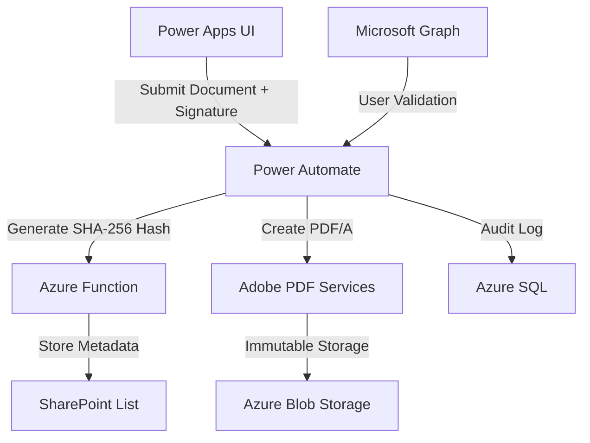

# FDA Part 11 Compliant Electronic Signature Approval Workflow

[](https://powerplatform.microsoft.com/)
[](LICENSE)

A secure, auditable, and FDA Part 11-compliant electronic signature approval workflow built on Microsoft Power Platform. This solution ensures **data integrity**, **non-repudiation**, and **regulatory compliance** for critical processes in life sciences and regulated industries.

---

## 📜 Features

### **FDA Part 11 Compliance**
- **Electronic Signature Binding**  
  Digitally binds signatures to approval records using SHA-256 hashing.
- **Audit Trail**  
  Tracks user actions (submission/approval/rejection) with timestamps, IP addresses, and user context.
- **Data Integrity**  
  Immutable storage of approval records as PDF/A files with cryptographic hashes.
- **Access Control**  
  Enforces Azure AD authentication and role-based permissions.

### **Core Functionality**
- **Signature Capture**  
  Pen-based signature input via Power Apps (`PenInput` control).
- **Document Management**  
  Securely upload and store documents in SharePoint with version control.
- **Automated Workflow**  
  Power Automate orchestrates approval routing, notifications, and compliance checks.
- **Tamper-Evident Storage**  
  Approval records hashed and stored in SharePoint/Azure Blob Storage.

---

## 🛠️ Architecture


## 🚀 Getting Started
**Prerequisites**
Prerequisites
- Microsoft Power Platform Environment (Production)
- Azure Subscription (for Azure Functions/Blob Storage)
- SharePoint Online Document Library
- Azure AD App Registration (with User.Read, Files.ReadWrite permissions)

## Setup Guide
1. Clone Repository
```
https://github.com/meiweijun/FDA_Project.git
```

2. Power Platform Deployment
- Import Power Apps [(https://github.com/meiweijun/FDA_Project/blob/main/PDAUI.zip)](/PDAUI.zip)
- Configure connections:
  - SharePoint (document storage)
  - Office 365 User
3. Configure SharePoint
- DocumentName(Text)
- SHA-256(Text)
- SignatureBase64(MutipleRowText)
- Status(Pending,Approve,Reject)
- Submitter(People)
- TimeStamp(Text)


## 🔍 Usage
1. Submit Approval Request
  1. Upload Document: Select a PDF/Word file in Power Apps.
  2. Capture Signature: Sign using the PenInput control.
  


2. Submit: Triggers Power Automate flow to:
-  Generate SHA-256 hash of the signature
-  Store approval metadata and attachement file in SharePoint 


3. You can add an approval workflow to the SharePoint list. Additionally, add logging operations.

## 🧪 Compliance Validation
FDA Part 11 Requirement	Implementation
- §11.10(a): Limited Access	Azure AD RBAC + SharePoint Permissions
- §11.50: Audit Trails	 Audit Logs with IP/User/Timestamp
- §11.70: Signature Binding	SHA-256 Hash + PDF/A Metadata Embedding
- §11.200: Electronic Copies	Immutable PDF/A in SharePoint

Disclaimer: This template requires customization for specific organizational policies and regulatory environments.


---

### Key Documentation Assets to Include:
1. **/Solutions/FDA_Approval_Flow.zip**  
   - Power Platform solution (Power Apps + Power Automate flows).

This structure provides technical depth while emphasizing compliance, making it suitable for both developers and QA/regulatory teams.

If you have any questions, please raise them in the issue!


