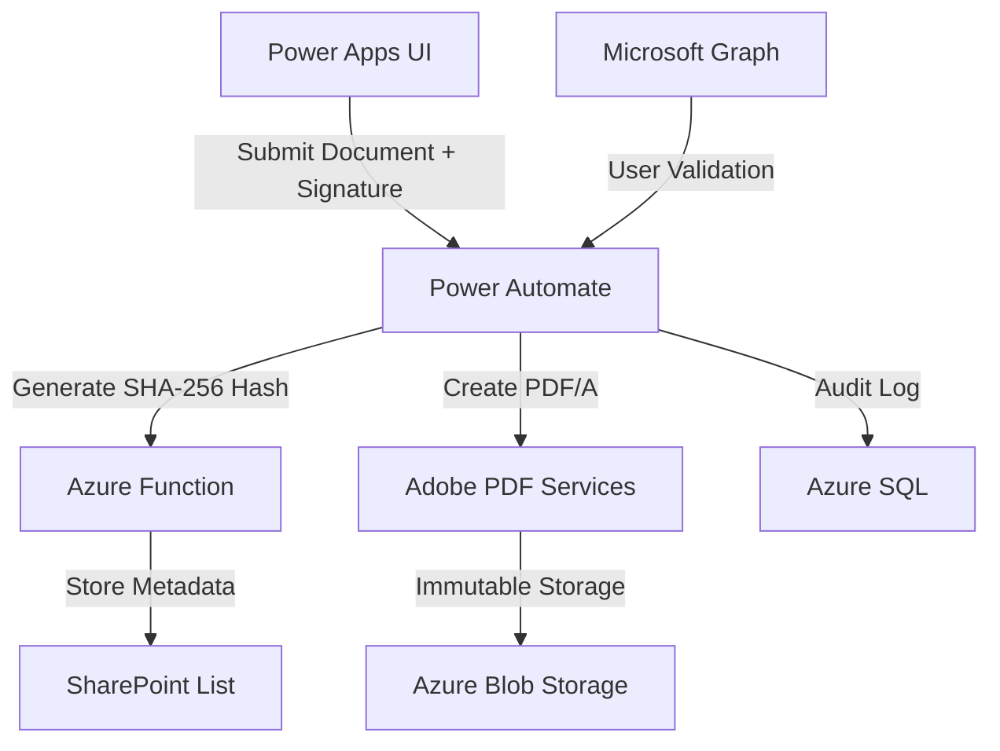

# FDA Part 11 Compliant Electronic Signature Approval Workflow

A secure, auditable, and FDA Part 11-compliant electronic signature approval workflow built on Microsoft Power Platform. This solution ensures **data integrity**, **non-repudiation**, and **regulatory compliance** for critical processes in life sciences and regulated industries.

---

## 📜 Features

### **FDA Part 11 Compliance**
- **Electronic Signature Binding**  
  Digitally binds signatures to approval records using SHA-256 hashing.
- **Audit Trail**  
  Tracks user actions (submission/approval/rejection) with timestamps, IP addresses, and user context.
- **Data Integrity**  
  Immutable storage of approval records as PDF/A files with cryptographic hashes.
- **Access Control**  
  Enforces Azure AD authentication and role-based permissions.

### **Core Functionality**
- **Signature Capture**  
  Pen-based signature input via Power Apps (`PenInput` control).
- **Document Management**  
  Securely upload and store documents in SharePoint with version control.
- **Automated Workflow**  
  Power Automate orchestrates approval routing, notifications, and compliance checks.
- **Tamper-Evident Storage**  
  Approval records hashed and stored in SharePoint/Azure Blob Storage.

---

## 🛠️ Architecture

## 🚀 Getting Started
**Prerequisites**

